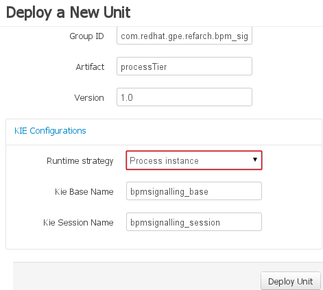
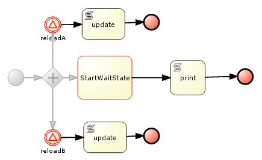

:data-uri:
:toc2:
:rhtlink: link:https://www.redhat.com[Red Hat]
:bpmproduct: link:https://access.redhat.com/site/documentation/en-US/Red_Hat_JBoss_BPM_Suite/[Red Hat's BPM Suite 6 product]
:dockerbpms: link:https://github.com/jboss-gpe-ose/docker_bpms/blob/master/doc/userguide.adoc[docker_bpms]

image::images/rhheader.png[width=900]

:numbered!:
[abstract]
== Concurrent PInstance Signal

:numbered:

== Overview

Often times, it is possible that multiple signals could be invoked on a process instance that is in a wait state at the same time.
A business application should not have to concern itself with ensuring that external signals to a process instance in a wait state are synchronized.
Instead, the process engine should be able to handle concurrent signals to the same process instance in a graceful manner.
The purpose of the *ConcurrentPInstanceSignal* process is to demonstrate the behavior of the BPM Suite 6 process engine when concurrent signals are invoked on the same process instance in a wait-state.

image::images/concurrentPInstanceSignal.png[]

As depicted in the above diagram, the ConcurrentPInstanceSignal process includes the following branches:

. *StartWaitState* ServiceTask:
+
This is the main branch of the process and is initiated when a the process instance is started.
_StartWaitState_ Service Task is mapped to a custom work item handler included in the _processTier_ project called:  com.redhat.gpe.refarch.bpm_signalling.processTier.StartWaitState.
This custom WIH does nothing but log its state.
Most importantly, it intentionally does *not* call: workItemManager.completeWorkItem().
Thus, a wait state of the process instance is invoked at this node.
. *reloadA* catching signal event:  
+
routes to update script task that increments p1 and sleeps for 5 seconds
. *reloadB* catching signal event:  
+
routes to update script task that increments p1 and sleeps for 5 seconds

In this reference architecture, an instance of the _ConcurrentPInstanceSignal_ BPMN2 process will be invoked via the REST API of the BPM Suite 6 Execution Server.

NOTE: Two instances of the _ConcurrentPInstanceSignal_ process will be instantiated and signaled.
The first process instance will be instantiated and signaled using a _PER_PROCESS_INSTANCE_ KIE session strategy.
The second process instance will be instantiated and signaled using a _SINGLETON_ KIE session strategy.

== Pre-Requisites

. ssh client
. maven 3.0.5 (or greater)
. git client
. curl
. familiarity with {bpmproduct}
. proficiency with basic *nix command line
. docker
. either the mysql or postgresql variant of the {dockerbpms} image

== Set-up

=== local:  Clone this reference architecture

This reference architecture will be cloned both in your local computer as well as in your remote BPM Suite 6 Openshift environment.
To clone this reference architecture in your local environment, execute the following:

--------
git clone https://github.com/jboss-gpe-ref-archs/bpm_signalling.git
--------

Doing so will create a directory in your local computer called:  bpm_signalling.
For the purposes of this documentation, this directory will be referred to as $REF_ARCH_HOME.

=== local: Build the Reference Architecture
The $REF_ARCH_HOME/wih directory contains several custom workItemHandler implementations.
Of interest is the wih called:  com.redhat.gpe.refarch.bpm_signalling.processtier.StartWaitState.
These workItemHandler classes need to be built and deployed to the java classpath of BPM Suite 6.

. cd $REF_ARCH_HOME
. mvn clean install -DskipTests

+
The end result is a jar file containing various custom workItemHandlers:  $REF_ARCH_HOME/wih/target/gpe-wih.jar .

=== local: deploy StartWaitState workItemHandler
. Secure copy gpe-wih.jar to business central web archive

+
-----
scp $REF_ARCH_HOME/wih/target/gpe-wih.jar  <ssh.url.to.your.bpm.environment>:~/bpms/standalone/deployments/business-central.war/WEB-INF/lib
-----

=== BPM Suite 6:  modify CustomWorkItemHandlers.conf

. ssh into your remote BPM Suite 6 environment
. vi $JBOSS_HOME/standalone/deployments/business-central.war/WEB-INF/classes/META-INF/CustomWorkItemHandlers.conf
. append the following entry to the list of Service Task names to workItemHandler mappings:

+
-----
"StartWaitState": new com.redhat.gpe.refarch.bpm_signalling.wih.StartWaitState(ksession)
-----

. bounce BPM Suite 6

=== clone *bpm_signalling* repo
This reference architecture includes a _KIE project_ called _processTier_ that includes various BPM signaling use cases.
This section of the documentation provides guidance on cloning of this reference architecture in BPM Suite 6.

. Log into the BPM Console web application of BPM Suite 6
. Create an organization unit
.. In the BPM Console, navigate to:  Authoring -> Administration -> Organizational Units -> Manage Organizational Units
.. Click the _Add_ button and enter in your organizational unit name
+
Any name will do.  We in Red Hat's Global Partner Enablement team typically use an organization name of:  _gpe_.
. clone this git repository as follows:
.. In the BPM Console, naviate to:  Authoring -> Administration -> Repositories -> Clone Repositories
.. Enter in values as per below:
+
image::images/clone.png[]
+
In particular, repository values should be as follows:

... *Repository Name* :   bpmsignalling
... *Organizational Unit* :   replace with your organization name
... *Git URL* :  https://github.com/jboss-gpe-ref-archs/bpm_signalling

=== Deploy *processTier* KIE project
The _bpmsignalling_ repository includes a single _KIE project_ called:  _processTier_.
This KIE project includes a variety of BPMN2 process definitions and custom workItemHandlers that show-case the signaling capabilities of BPM Suite 6.
Deployment of the _processTier_ project is needed to make its contents available for use by the BPM Suite 6 process engine.

. In the BPM Console,navigate to:  Deploy -> Deployments -> New Deployment Unit
. A pop-up should appear as per below.
+

. Populate the contents of that pop-up as follows and press the `Deploy Unit` button:
.. *Group ID*:  com.redhat.gpe.refarch.bpm_signalling
.. *Artifact*:  processTier
.. *Version*:   1.0
.. *Runtime strategy*:  Process instance
.. *Kie Base Name*: bpmsignalling_base
.. *Kie Session Name*:  bpmsignalling_session

Of particular importance is the value of the *Runtime strategy*.
For the purpose of this reference architecture, the following KIE Session strategies will be used :

. *SINGLETON*
+
Default KIE Session strategy.
A single KIE session exists for each _Deployment Unit_.
JPA based KIE sessions are single-threaded.
Thus, if the KIE session is configured for JPA persistence and the KIE session strategy is selected as _SINGLETON_, then only one request can be handled at any given time per deployment unit.
This combination is probably fine for POCs and demos but is often times not ideal in high-volume production environments.

+
In-memory based KIE sessions are multi-threaded and do allow for concurrent requests to the process engine for a deployment unit.
In-memory KIE sessions are often use-ful for BPM use-cases that do not include a wait-state.
Thus, if an in-memory KIE session is configured and the KIE session strategy is selected as _SINGELTON_, then typically a huge volume of requests can be handled by the process engine.

. *PER_PROCESS_INSTANCE*
+
A KIE session is dedicated for the life of a process instance.
Often used in production environments in conjunction with a JPA based KIE session.
The combination of _PER_PROCESS_INSTANCE_ KIE session strategy with a JPA configured KIE session allows for concurrency of the process engine within a deployment unit.

== *ConcurrentPInstanceSignal* :  Execution

=== start *ConcurrentPInstanceSignal* instance
If this is the first time instantiating a _ConcurrentPInstanceSignal_ process, then ensure the the deployment unit is using a _PER_PROCESS_INSTANCE_ KIE session strategy.
If this is the second time instantiating a _ConcurrentPInstanceSignal_ process, then switch the deployment unit to use a _SINGLETON_ KIE session strategy.

In a terminal window in your local environment, execute the following command to initiate an instance of the _ConcurrentPInstanceSignal_ process :

------
curl -vv -u jboss:brms -X POST http://docker_bpms:8080/business-central/rest/runtime/com.redhat.gpe.refarch.bpm_signalling:processTier:1.0:bpmsignalling_base:bpmsignalling_session/process/processTier.concurrentPInstanceSignal/start?map_p1=5i
------

The parameter _p1=5i sets the value of the _p1_ process instance variable to the integer: 5 .

When the above curl commend is executed, the server.log of BPM Suite 6 will include a statement similar to the following:

------
[StartWaitState] executeWorkItem() pInstance = WorkflowProcessInstance11 [processId=processTier.concurrentPInstanceSignal,state=1]
[StartWaitState] executeWorkItem() ksessionId = 2 : pInstanceId = 11 : workItemId = 1 : p1 = 5

------

Make note of the value of the  _pInstanceId_ .  
This value will be used in the next section of this reference architecture.

The process instance is now in a wait-state:  (notice the _StartWaitState_ node high-lighted in red)

For the purposes of this reference architecture, the process instance will remain in this wait-state.

=== signal *concurrentPInstanceSignal* instance
Now that an instance of _concurrentPInstanceSignal_ is in a wait-state, the next step is to signal this process instance by two clients at the same time.
This can be done using the curl utility in two command terminals.

. In a command terminal, copy the following command (but do not execute quite yet):
+
-----
curl -vv -u jboss:brms -X POST 'http://docker_bpms:8080/business-central/rest/runtime/com.redhat.gpe.refarch.bpm_signalling:processTier:1.0:bpmsignalling_base:bpmsignalling_session/process/instance/11/signal?signal=reloadA'
-----
.  replace the value of the process instance id in the URL of the above command.
+ In the example above, the process instance id is:  11 .  Replace that value as appropriate.

. In a second terminal, copy the following command (but do not execute quite yet):
-----
curl -vv -u jboss:brms -X POST 'http://docker_bpms:8080/business-central/rest/runtime/com.redhat.gpe.refarch.bpm_signalling:processTier:1.0:bpmsignalling_base:bpmsignalling_session/process/instance/11/signal?signal=reloadB'
-----
. Similar to previous, replace the process instance id as appropriate.
. The script tasks in each branch are coded to sleep for 5 seconds each.
That forces the KIE session used for this process instance to be active for 5 seconds.
Subsequently, execute the above two curl commands within 5 seconds of each other to view the behavior of the process engine when two signals are made to the same active process instance.

=== Complete the process
At this point two of the three parallel legs in the process have finished execution, but the middle leg is still in a wait state.  
Use the following command to send a signal that work of the task node has been completed, so that the process may continue to completion.

. In a command terminal, copy the following command
-----
curl -vv -u jboss:brms -X POST 'http://docker_bpms:8080/business-central/rest/runtime/com.redhat.gpe.refarch.bpm_signalling:processTier:1.0:bpmsignalling_base:bpmsignalling_session/workitem/3/complete?runtimeProcInstId=3'
-----

. Replace the workitem number and the process Instance Id in the command with values that match your server log, then execute the command.

The process instance terminates as a result.

==== Programmatic retrieval of workItemId ?

Is our recommendation to expose a custom API that queries the database ?

-----
jbpm=# select workitemid from workiteminfo where processinstanceid=19 and name='StartWaitState';
 workitemid 
------------
         12
-----

=== Results

==== PER_PROCESS_INSTANCE KIE Session Strategy
This section discusses the results of having instantiated and signaled the _ConcurrentPInstanceSignal_ process using a deployment unit configured for a _PER_PROCESS_INSTANCE_ KIE session.

A process engine configured to use a JPA enabled KIE session whose strategy is of type PER_PROCESS_INSTANCE gracefully handles concurrent signals to the same active process instance.
The expected final value of the _p1_ process instance variable is 7 (initial value of 5 plus incrementing by 1 by each signal branch).
To view the final value of the _p1_ process instance, execute the following:

. Navigate in the BPM Console to:  Process Management -> Process Instances
. Select your process instance by clicking the Magnifying Glass icon in the _Actions_ column of the process instance.
. In the _Instance Details_ panel, select:  Views -> Process Variables.

Also of note is that HTTP 200 response codes were returned back to the curl clients.
The BPM Suite 6 process engine gracefully handled concurrent signals to the same process instance without the client code being exposed to any process instance state conflicts.
Subsequently, a client application that signals a process instance in BPM Suite 6 does not need to code exception handling and re-try logic.

Since two signals were invoked within 5 seconds of each other on the same active process instance, there naturally was a state conflict.
This process instance state conflict was handled by the process engine.
Evidence of this process instance state conflict can be bound in the server.log of the BPM Suite 6 environment:

-----
16:47:30,060 INFO  [stdout] concurrentPInstanceSignal.updateOnly() reloadB:  p1 = 6 : will now sleep
16:47:31,263 INFO  [stdout] concurrentPInstanceSignal.updateOnly() reloadA:  p1 = 6 : will now sleep
16:47:35,061 INFO  [stdout] concurrentPInstanceSignal.updateOnly() reloadB:  i'm back
16:47:36,264 INFO  [stdout] concurrentPInstanceSignal.updateOnly() reloadA:  i'm back
16:47:36,271 WARN  [com.arjuna.ats.arjuna] (http-2ca2d7a7d3b1/172.17.0.2:8080-3) ARJUNA012125: TwoPhaseCoordinator.beforeCompletion - failed for SynchronizationImple< 0:ffffac110002:-69b8798a:539b5f01:69f, org.hibernate.engine.transaction.synchronization.internal.RegisteredSynchronization@14809963 >: javax.persistence.OptimisticLockException: org.hibernate.StaleObjectStateException: Row was updated or deleted by another transaction (or unsaved-value mapping was incorrect): [org.drools.persistence.info.SessionInfo#2]
	at org.hibernate.ejb.AbstractEntityManagerImpl.wrapStaleStateException(AbstractEntityManagerImpl.java:1416) [hibernate-entitymanager-4.2.0.SP1-redhat-1.jar:4.2.0.SP1-redhat-1]

.....

16:47:36,359 INFO  [stdout] concurrentPInstanceSignal.updateOnly() reloadA:  p1 = 7 : will now sleep
16:47:41,359 INFO  [stdout] concurrentPInstanceSignal.updateOnly() reloadA:  i'm back
-----

Notice the OptimisticLockException thrown by the _routeA_ branch of the process instance.
The _routeB_ branch, owning the most recent of the two OptimisticLock timestamps on the KIE session, won the right to persist its state to the database.
The _routeA_ branch, owning the older of the two OptimisticLock timestamps on the KIE session, lost the right to persist its state to the database.
The BPM Suite 6 process engine detected this condition and automatically retried the execution of the _reloadA_ branch with a new OptimisticLock timestamp.

==== SINGLETON KIE Session Strategy
This section discusses the results of having instantiated and signaled the _ConcurrentPInstanceSignal_ process using a deployment unit configured for a _SINGLETON_ KIE session.

A process engine configured to use a JPA enabled KIE session whose strategy is of type SINGLETON gracefully handles concurrent signals to the same active process instance.
This is expected to be the case as a JPA enabled SINGLETON KIE session is single-threaded.
The request from the curl client that invoked the _reloadA_ branch was processed first while the process engine operated in a _synchronized{..} block of code.
The request from the curl client that invoked the _reloadB_ branch was blocked until the completion of processing on the _reloadA_ branch.

== To-Do

. Programmatic retrieval of workItemId ?
+
Is our recommendation to expose a custom API that queries the database ?
+
-----
jbpm=# select workitemid from workiteminfo where processinstanceid=19 and name='StartWaitState';
 workitemid 
------------
         12
-----

. Pessimistic Locking Support
+
BPM Suite 6.1 introduces Pessimistic Locking Support.
Could use this as an alternative to OptimisticLock when volume of concurrent signals on the same pInstance is expected to be high.
+
https://documentation-devel.engineering.redhat.com/site/documentation/en-US/Red_Hat_JBoss_BPM_Suite/6.1/html-single/Administration_And_Configuration_Guide/index.html#Process_Instance

