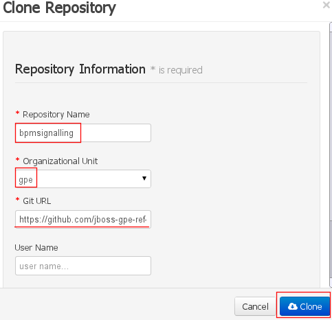
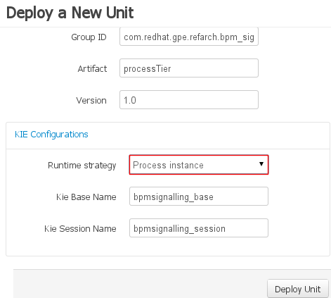

:data-uri:
:toc2:
:rhtlink: link:https://www.redhat.com[Red Hat]
:bpmproduct: link:https://access.redhat.com/site/documentation/en-US/Red_Hat_JBoss_BPM_Suite/[Red Hat's BPM Suite 6 product]
:dockerbpms: link:https://github.com/jboss-gpe-ose/docker_bpms/blob/master/doc/userguide.adoc[docker_bpms]

image::images/rhheader.png[width=900]

:numbered!:
[abstract]
== JBoss GPE Reference Architecture:  Template

:numbered:

== Abstract

== Overview

== Pre-Requisites

. ssh client
. maven 3.0.5 (or greater)
. git client
. curl
. familiarity with {bpmproduct}
. proficiency with basic *nix command line
. docker
. either the mysql or postgresql variant of the {dockerbpms} image

== Procedure
For the purposes of this documentation, the name _$REF_ARCH_HOME_ refers to the root directory of this reference architecture.

=== Start BPM Suite 6
As per the {dockerbpms} documentation, pull and start either the mysql or postgresql variants.

For the purposes of this documentation, the name *docker_bpms* will refer to the ip address of your bpm enabled docker container.
A suggestion would be to add an entry in your /etc/hosts that maps *docker_bpms* to the ip address of your docker container:

-----
172.17.0.2      docker_bpms
-----

NOTE:  the ip address of your docker container is most likely different than the example above.
Check the {dockerbpms} user guide on how to determine the ip address.

=== Log into BPM Suite 6

. As per the {dockerbpms} user guide, ssh into the bpm enabled docker container and tail the server.log.
. Via your browser, login to business-central.

=== clone *bpm_signalling* repo
Create an organization unit and clone this git repository as follows:

=== Deploy *processTier* KIE project

== *concurrentPInstanceSignal* process instance

image::images/concurrentPInstanceSignal.png[]

ConcurrentPInstanceSignal process branches as follows:

. *StartWaitState* node:  updates p1 variable and does not call workItemManager.completeWorkItem().
Thus, a wait state of the process instance is invoked.
. *reloadA* catching signal event:  routes to update script task that increments p1 and sleeps for 5 seconds
. *reloadB* catching signal event:  routes to update script task that increments p1 and sleeps for 5 seconds

=== start *concurrentPInstanceSignal* instance

------
curl -vv -u jboss:brms -X POST http://docker_bpms:8080/business-central/rest/runtime/com.redhat.gpe.refarch.bpm_signalling:processTier:1.0:bpmsignalling_base:bpmsignalling_session/process/processTier.concurrentPInstanceSignal/start?map_p1=5i
------

The server.log of BPM Suite 6 will include a statement similar to the following:

------
[ChangePInstanceVariable] executeWorkItem() ksessionId = 2 : pInstanceId = 11 : workItemId = 1 : p1 = 6

------

Make note of the value of the  _pInstanceId_ .  This value will be used in the next section of this reference architecture.

=== signal *concurrentPInstanceSignal* instance

-----
curl -vv -u jboss:brms -X POST 'http://docker_bpms:8080/business-central/rest/runtime/com.redhat.gpe.refarch.bpm_signalling:processTier:1.0:bpmsignalling_base:bpmsignalling_session/process/instance/11/signal?signal=reloadA'
-----

-----
curl -vv -u jboss:brms -X POST 'http://docker_bpms:8080/business-central/rest/runtime/com.redhat.gpe.refarch.bpm_signalling:processTier:1.0:bpmsignalling_base:bpmsignalling_session/process/instance/11/signal?signal=reloadB'
-----

== To-Do
