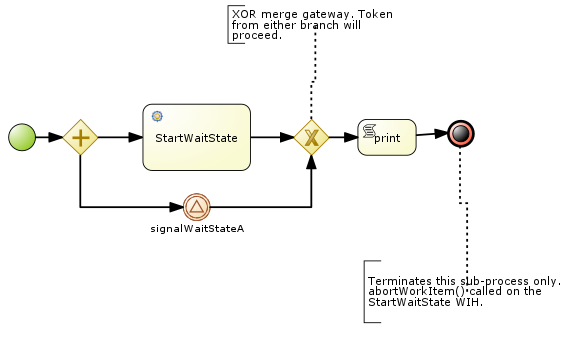

:data-uri:
:toc2:
:rhtlink: link:https://www.redhat.com[Red Hat]
:bpmproduct: link:https://access.redhat.com/site/documentation/en-US/Red_Hat_JBoss_BPM_Suite/[Red Hat's BPM Suite 6 product]
:dockerbpms: link:https://github.com/jboss-gpe-ose/docker_bpms/blob/master/doc/userguide.adoc[docker_bpms]

image::images/rhheader.png[width=900]

:numbered!:
[abstract]
== JBoss GPE Reference Architecture:  BPM Signaling

:numbered:

== Overview

=== *ConcurrentPInstanceSignal* example

image::images/concurrentPInstanceSignal.png[]

Often times, it is possible that multiple signals could be invoked on a process instance that is in a wait state at the same time.
A business application should not have to concern itself with ensuring that external signals to a process instance in a wait state are synchronized.
Instead, the process engine should be able to handle concurrent signals to the same process instance in a graceful manner.
The purpose of the *ConcurrentPInstanceSignal* process is to demonstrate the behavior of the BPM Suite 6 process engine when concurrent signals are invoked on the same process instance in a wait-state.

Details and instructions to execute this example can be found link:concurrent_pinstance_signal.adoc[here].

=== *Signal SubProcess Wait-State* 

This example includes the following parent process and re-usable sub-process:

.signalSubprocess
image::images/signalSubprocess.png[]

.waitForSignal sub-process

The purpose of this example is to demonstrate the behavior of the process engine in processing of the two process instances when a signal is sent to the _catching signal event_ of a re-usable sub-process.
Of note is the different behavior that occurs depending on if the KIE session strategy of the process engine is either _SINGLETON_ or _PER_PROCESS_INSTANCE_.

Instructions to execute this example can be found link:signal_subprocess_waitstate.adoc[here].

== To-Do
