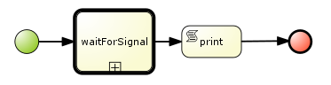
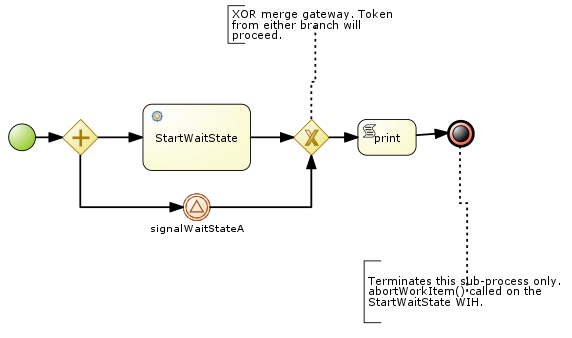
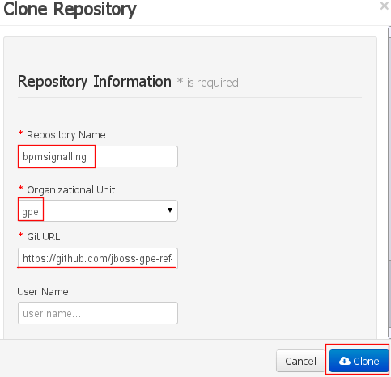

:data-uri:
:toc2:
:bpmproduct: link:https://access.redhat.com/site/documentation/en-US/Red_Hat_JBoss_BPM_Suite/[Red Hat's BPM Suite 6 product]
:dockerbpms: link:https://github.com/jboss-gpe-ose/docker_bpms/blob/master/doc/userguide.adoc[docker_bpms]

image::images/rhheader.png[width=900]

:numbered!:
[abstract]
== Signal Subprocess Wait-State

:numbered:

== Overview
The purpose of this refence architecture is to demonstrate the behavior of the process engine when a signal is sent to the _catching signal event_ (called _signalWaitStateA_ ) of a re-usable sub-process.
Of note is the different behavior that occurs depending on if the KIE session strategy of the process engine is either _SINGLETON_ or _PER_PROCESS_INSTANCE_.

This example includes the following parent process (Figure 1) and its re-usable sub-process (Figure 2):

.signalSubprocess

.waitForSignal sub-process

== Pre-Requisites

. ssh client
. maven 3.0.5 (or greater)
. git client
. curl
. familiarity with {bpmproduct}
. proficiency with basic *nix command line
. docker
. either the mysql or postgresql variant of the {dockerbpms} image

== Set-up

=== local:  Clone this reference architecture

This reference architecture will be cloned both in your local computer as well as in your remote BPM Suite 6 Openshift environment.
To clone this reference architecture in your local environment, execute the following:

--------
git clone https://github.com/jboss-gpe-ref-archs/bpm_signalling.git
--------

Doing so will create a directory in your local computer called:  bpm_signalling.
For the purposes of this documentation, this directory will be referred to as $REF_ARCH_HOME.

=== local: Build the Reference Architecture
The $REF_ARCH_HOME/wih directory contains several custom workItemHandler implementations.
Of interest is the wih called:  com.redhat.gpe.refarch.bpm_signalling.processtier.StartWaitState.
These workItemHandler classes need to be built and deployed to the java classpath of BPM Suite 6.

. cd $REF_ARCH_HOME
. mvn clean install -DskipTests

+
The end result is a jar file containing various custom workItemHandlers:  $REF_ARCH_HOME/wih/target/gpe-wih.jar .

=== local: deploy StartWaitState workItemHandler
. Secure copy gpe-wih.jar to business central web archive

+
-----
scp $REF_ARCH_HOME/wih/target/gpe-wih.jar  <ssh.url.to.your.bpm.environment>:~/bpms/standalone/deployments/business-central.war/WEB-INF/lib
-----

=== BPM Suite 6:  modify CustomWorkItemHandlers.conf

. ssh into your remote BPM Suite 6 environment
. vi $JBOSS_HOME/standalone/deployments/business-central.war/WEB-INF/classes/META-INF/CustomWorkItemHandlers.conf
. append the following entry to the list of Service Task names to workItemHandler mappings:

+
-----
"StartWaitState": new com.redhat.gpe.refarch.bpm_signalling.wih.StartWaitState(ksession)
-----

. bounce BPM Suite 6

=== clone *bpm_signalling* repo
This reference architecture includes a _KIE project_ called _processTier_ that includes various BPM signaling use cases.
This section of the documentation provides guidance on cloning of this reference architecture in BPM Suite 6.

. Log into the BPM Console web application of BPM Suite 6
. Create an organization unit
.. In the BPM Console, navigate to:  Authoring -> Administration -> Organizational Units -> Manage Organizational Units
.. Click the _Add_ button and enter in your organizational unit name
+
Any name will do.  We in Red Hat's Global Partner Enablement team typically use an organization name of:  _gpe_.
. clone this git repository as follows:
.. In the BPM Console, naviate to:  Authoring -> Administration -> Repositories -> Clone Repositories
.. Enter in values as per below:
+

+
In particular, repository values should be as follows:

... *Repository Name* :   bpmsignalling
... *Organizational Unit* :   replace with your organization name
... *Git URL* :  https://github.com/jboss-gpe-ref-archs/bpm_signalling

== *Execution* 
Included in the _bpmsignalling_ repository is a KIE project called:  _processTier_.
The _processTier_ KIE project includes two process definitions called:  _signalSubprocess_ and _waitForSignal_.
Process instances of these BPMN2 definitions will be instantiated.
Subsequently, this reference architecture will demonstrate the behavior of the process engine when configured using the following KIE session strategies and then signalled by a remote client:

. SINGLETON
. PER_PROCESS_INSTANCE

=== *SINGLETON* Strategy
The first scenario will involve using the default KIE session strategy:  SINGLETON.
A singleton KIE session produces a single-threaded process engine that remains alive for the life of the BPM Execution Server and handles all requests for every process instance.
This strategy is appropriate for BPM use-cases with relatively low load.

==== SINGLETON: Deploy *processTier* KIE project
Execute the following to create a deployment unit whose process engine utilizes a SINGLETON KIE session strategy.

. In the BPM Console,navigate to:  Authoring -> Tools -> Process Explorer
. Click the _Build and Deploy_ button.

==== SINGLETON: start processes 

In a terminal window in your local environment, execute the following command to instantiate an instance of the _signalsubprocess_ process definition and its sub-process:

------
curl -vv -u jboss:brms -X POST http://docker_bpms:8080/business-central/rest/runtime/com.redhat.gpe.refarch.bpm_signalling:processTier:1.0/process/processTier.signalsubprocess/start
------

The BPM Suite 6 server.log should now include statements similar to the following:

-----
INFO  [StartWaitState] executeWorkItem() pInstance = WorkflowProcessInstance144 [processId=processTier.waitForSignal,state=1]
INFO  [StartWaitState] executeWorkItem() ksessionId = 66 : pInstanceId = 144 : workItemId = 146 : p1 = 0
-----

Two different process instances have been created as depicted in the _jbpm_ database:

-----
jbpm=# select instanceid, processid from processinstanceinfo;
 instanceid |          processid           
------------+------------------------------
        145 | processTier.signalsubprocess
        146 | processTier.waitForSignal
(2 rows)
-----

These process instances are now in a wait-state.

==== SINGLETON: signal process engine
This section of the reference architecture involves signalling the process engine. 
The process engine and its SINGLETON KIE session are knowledgeable of all process instances for a deployment unit.
Therefore, a signal to the this KIE session will be caught by all known process instances with a _capturing intermediary signal event_ of the same name as the signal.

The following command sends a signal of name _signalWaitStateA_ to the KIE session of the deployment unit.

------
curl -vv -u jboss:brms -X POST http://docker_bpms:8080/business-central/rest/runtime/com.redhat.gpe.refarch.bpm_signalling:processTier:1.0/signal?signal=signalWaitStateA
------

The BPM Suite 6 server.log should now include statements similar to the following:

-----
INFO  [stdout] waitForSignal.print() ... completing subprocess
[StartWaitState] abortWorkItem() ksessionId = 66 : pInstanceId = 146 : workItemId = 147
[stdout] signalSubprocess() completing ...
-----

Inspect the _jbpm_ database and notice that records for the previous two process instances no longer exist.
The two process instanced have completed due to the _waitForSignal_ subprocess having been signaled.

If interested, repeat this entire scenario using the SINGLETON kie session with one change: 
after having instantiated the process instances, bounce the Execution Server of BPM Suite 6 (ie:  kill and restart the java process).
Afterwards, signal the process engine as was done previously.
Do you observe the same results ?

*Answer:*  yes, the behavior of the process engine after having been bounced is the same.

=== *PER_PROCESS_INSTANCE* strategy
The second scenario of this reference architecture will involve using a KIE session strategy of:  PER_PROCESS_INSTANCE.
This strategy dedicates a KIE session to the life of a process instance.
This strategy allows for simultaneous execution of concurrent requests to different BPMN2 instances.
Subsequently, this strategy is the ideal choice for many BPM use cases involving long-running processes.

==== PER_PROCESS_INSTANCE: Deploy *processTier* KIE project

In the previous example (using SINGLETON kie strategy), the KIE project was manually built and deployed via the BPM Console.
Subsequently, the project does not need to be re-built .... only re-deployed specifying the different KIE session strategy.

The following commands undeploy the previous deployment unit, query the execution server to ensure the async undeploy job succeeded and then finally redeploy using a PER_PROCESS INSTANCE strategy:

-----
curl -v -u jboss:brms -X POST http://docker_bpms:8080/business-central/rest/deployment/com.redhat.gpe.refarch.bpm_signalling:processTier:1.0/undeploy
curl -vv -u jboss:brms -X GET http://docker_bpms:8080/business-central/rest/deployment/
curl -v -u jboss:brms -X POST http://docker_bpms:8080/business-central/rest/deployment/com.redhat.gpe.refarch.bpm_signalling:processTier:1.0/deploy?strategy=PER_PROCESS_INSTANCE
-----

==== PER_PROCESS_INSTANCE: start processes 

In a terminal window in your local environment, execute the following command to instantiate an instance of the _signalsubprocess_ process definition and its sub-process:

------
curl -vv -u jboss:brms -X POST http://docker_bpms:8080/business-central/rest/runtime/com.redhat.gpe.refarch.bpm_signalling:processTier:1.0/withvars/process/processTier.signalsubprocess/start
------

Notice the subtle difference betwen this RESTful invocation and the similar RESTful invocation used previously to start a process instance when the KIE session strategy was SINGLETON.
Specifically, notice that the RESTful resource specified now includes _withvars_ in the URI path.
The reason the RESTful resource URI specifies _withvars_ is because the response payload back to the client includes the pInstanceId of the parent process that was instantiated and is currently in a wait-state.

Inspect the payload response for the process instance id:

-----
<?xml version="1.0" encoding="UTF-8" standalone="yes"?><process-instance-with-vars><status>SUCCESS</status><url>http://docker_bpms:8080/business-central/rest/runtime/com.redhat.gpe.refarch.bpm_signalling:processTier:1.0/withvars/process/processTier.signalsubprocess/start</url><variables/><processInstance><process-id>processTier.signalsubprocess</process-id><id>180</id><state>1</state></processInstance></process-instance-with-vars>
-----

In the above payload response, the pInstanceId is:  180.
This pInstanceId of the parent process will be needed later in this exercise.

In addition, the BPM Suite 6 server.log should now include statements similar to the following:

-----
INFO  [StartWaitState] executeWorkItem() pInstance = WorkflowProcessInstance181 [processId=processTier.waitForSignal,state=1]
INFO  [StartWaitState] executeWorkItem() ksessionId = 69 : pInstanceId = 181 : workItemId = 181 : p1 = 0
-----

Two different process instances have been created as depicted in the _jbpm_ database:

-----
jbpm=# select instanceid, processid from processinstanceinfo;
 instanceid |          processid           
------------+------------------------------
        180 | processTier.signalsubprocess
        181 | processTier.waitForSignal
(2 rows)
-----

These process instances are now in a wait-state.

==== PER_PROCESS_INSTANCE: signal pInstance

In the previous example, the process engine and its SINGLETON KIE session were signalled via a curl command that invokes the BPM execution server.
Because, the SINGLETON KIE session manages all process engines, the signal was captured by the _catching signal event_ of the _waitForSignal_ sub-process.

Repeat execution of the same curl command used previously to signal the process engine.
What is observed when the process engine's KIE strategy is now set to PER_PROCESS_INSTANCE ?
The expected result is that nothing happens.
The _waitForSignal_ sub-process currently in a wait-state is not signalled.

When a PER_PROCESS_INSTANCE KIE session strategy is specified, the command used to signal needs to be explicit about the pInstanceId it intends to signal.
Consequently, the next step is to determine the pInstanceId of the sub-process using the pInstanceId of the parent process:

. Log into the _jbpm_ database
. execute the following query
.. NOTE:  replace the value of _parentprocessinstanceid_ with the actual value of the parent instance id returned in the response payload when the process was started.

+
-----
jbpm=# select processinstanceid from processinstancelog where processid='processTier.waitForSignal' and parentprocessinstanceid=180;
 processinstanceid 
-------------------
                181
-----

Now that the pInstanceId of the subprocess is known, that specific sub-process can be signalled as follows:

-----
curl -vv -u jboss:brms -X POST http://docker_bpms:8080/business-central/rest/runtime/com.redhat.gpe.refarch.bpm_signalling:processTier:1.0/process/instance/181/signal?signal=signalWaitStateA
-----

The BPM Suite 6 server.log should now include statements similar to the following:

-----
INFO  [stdout] waitForSignal.print() ... completing subprocess
[StartWaitState] abortWorkItem() ksessionId = 69 : pInstanceId = 181 : workItemId = 181
[stdout] signalSubprocess() completing ...
-----

Inspect the _jbpm_ database and notice that records for the previous two process instances no longer exist.
The two process instanced have completed due to the _waitForSignal_ subprocess having been signaled.

== To-Do

. Extend the Execution Server to allow easy ability to get the pInstanceId of a subprocess given the parent pInstanceId and the name of the sub-process.
. Change lab instructions to be specific to on-line Openshift environment rather than Docker
