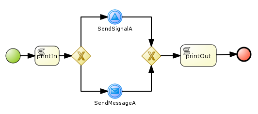
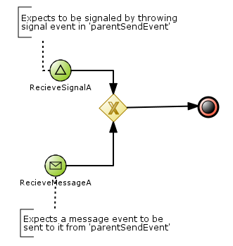
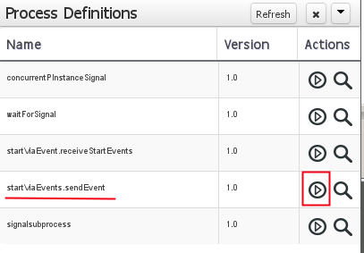
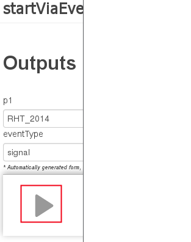

:data-uri:
:toc2:
:startprocesseventlistener: link:https://github.com/droolsjbpm/jbpm/blob/master/jbpm-flow/src/main/java/org/jbpm/process/instance/ProcessRuntimeImpl.java#L347[StartProcessEventListener class]
:jbpmrelease: link:https://repository.jboss.org/nexus/content/groups/public-jboss/org/jbpm/jbpm-distribution/6.1.0.Final/jbpm-distribution-6.1.0.Final-installer.zip[community jbpm 6.1.0.Final release]
:jbpminstaller: link:http://docs.jboss.org/jbpm/v6.1.0.CR1/userguide/jBPMInstaller.html[jbpm v6.1.0.Final installer]

image::images/rhheader.png[width=900]

== Start Via Events

:numbered:

=== Overview

.sendEvent

image::images/blank.png[height=100]

.receiveStartEvents

image::images/blank.png[height=50]

==== Purpose
The purpose of this example is to deep-dive into various types of BPMN2 _process start events_ and their implementation in BPM Suite 6.
This example includes the two process diagrams depicted above.

==== Process details
Both of the above BPMN2 process definitions define a process variabled called _p1_ of type String.
The various script tasks simply log the value of the _p1_ process variable at that point in the process.

As a requirement of the {startprocesseventlistener}, the _DataInput_ property of the _SendSignalA_ throwing signal event node defines a _DataInput_ property of "_event_".
The _p1_ process variable is mapped to this _event_ DataInput property.

Similarly, the _DataOutput_ property of the _ReceiveSignalA_ Signal Start Event has a name of "_event_".
This _event_ DataOutput property is then mapped to the _p1_ process variable.

==== BPMN2 specification
The following is relevant material found in the BPMN2 specification (specifically, Section *10.4.2 Start Event* / Table *10.84*)  regarding _Start Events_:

. *Message Start Event*
+
A Message arrives from a Participant and triggers the start of the Process
See page 93 for more details on Messages.
If there is only one EventDefinition associated with the Start Event and that EventDefinition is of the subclass MessageEventDefinition, then the Event is a Message Start Event and MUST be displayed with an envelope marker (see the figure to the right).
The actual Participant from which the Message is received can be identified by connecting the Event to a Participant using a Message Flow within the definitional Collaboration of the Process – see Table 10.1.

. *Signal Start Event*
+
A Signal arrives that has been broadcast from another Process and triggers the start of the Process.
Note that the Signal is not a Message, which has a specific target for the Message.
Multiple Processes can have Start Events that are triggered from the same broadcasted Signal.
If there is only one EventDefinition associated with the Start Event and that EventDefinition is of the subclass SignalEventDefinition,then the Event is a Signal Start Event and MUST be displayed with a triangle marker (see the figure to the right).

=== Pre-Requisites

. ssh client
. maven 3.0.5 (or greater)
. git client
. curl
. familiarity with {bpmproduct}
. proficiency with basic *nix command line
. local installation of {jbpmrelease}
+
NOTE:  start events do not work in supported BPM Suite 6.0.2.
The fix is found only in the upstream community jbpm v6.1.0.Final.

=== Set-up

==== Local install of community jbpm v6.1.0.Final
Follow the instructions for the {jbpminstaller}

NOTE:  Although this example does not work in BPM Suite 6.0.2, the remainder of the documentation makes mention of the product.
For the purposes of this exercise, use community jbpm6.1.0.Final rather than BPM Suite 6.0.2.

==== clone *bpm_signalling* repo
This section of the documentation provides guidance on cloning of this reference architecture in the BPM Console of BPM Suite 6.

. Log into the BPM Console web application of BPM Suite 6
. Create an organization unit
.. In the BPM Console, navigate to:  Authoring -> Administration -> Organizational Units -> Manage Organizational Units
.. Click the _Add_ button and enter in your organizational unit name
+
Any name will do.  We in Red Hat's Global Partner Enablement team typically use an organization name of:  _gpe_.
. clone this git repository as follows:
.. In the BPM Console, naviate to:  Authoring -> Administration -> Repositories -> Clone Repositories
.. Enter in values as per below:
+
image::images/clone.png[]
+
In particular, repository values should be as follows:

... *Repository Name* :   bpmsignalling
... *Organizational Unit* :   replace with your organization name
... *Git URL* :  https://github.com/jboss-gpe-ref-archs/bpm_signalling

=== Deploy *processTier* project with _SINGLETON_ KIE session strategy
This reference architecture includes a _KIE project_ called _processTier_ that includes various BPM signaling use cases.

. Still in the BPM Console, navigate to:  Authoring -> Project Authoring -> Tools -> Project Editor
. Click the _Build & Deploy_ button

Doing so builds and deploys the _processTier_ KIE project and makes all of its BPMN2 process definitions avaialable for execution.
The default KIE session strategy used is of type:  _SINGLETON_.

=== Signal Start Event test : SINGLETON strategy
Now that the _processTier_ project has been deployed with a session strategy of _SINGLETON_, the _sendEvent_ and _receiveStartEvents_ are available for execution.
In this exercise, an instance of the  _startViaEvents.sendEvent_ process will be started and subsequently signal the start of the _startViaEvents.receiveStartEvents_ process.

. In the BPM Console, navigate to: Process Management -> Process Definitions
. In the list of BPMN2 process definitions that appear, click the start button on the _startViaEvents.sendEvent_ process definition
+

. In the pop-up that appears, enter any value for the property _p1_.
. In the _eventType_ text box, enter a value of:  _signal_
. Press the _start_ button
+

. View your BPM Suite 6 server.log and notice log statements similar to the following:

-----
2014-08-13 13:02:21,478 INFO  [stdout] parentSendEvent() starting
2014-08-13 13:02:21,504 INFO  [stdout] startViaEvent() p1 = RHT_2014
2014-08-13 13:02:21,519 INFO  [stdout] parentSendEvent() finishing.  p1 = RHT_2014
-----

The log is indicating the following :

. Instances of both process definitions were executed
. The value of the _p1_ process variable was correctly passed to the process started via the _signal start event node_.

For further verification, inspect the tables of the jbpm _processInstanceLog_ table.

=== Signal Start Event test : PER_PROCESS_INSTANCE strategy
Using a SINGLETON kie session strategy, signalling of a _signal start event_ executes as expected.
This section of the exercise runs the same test with a change to the KIE session strategy to:  PER_PROCESS_INSTANCE.
To do so, the project does not need to be re-built .... only re-deployed specifying the different KIE session strategy.

The following commands undeploy the previous deployment unit, query the execution server to ensure the async undeploy job succeeded and then finally redeploy using a PER_PROCESS INSTANCE strategy:

-----
curl -v -u jboss:brms -X POST http://docker_bpms:8080/business-central/rest/deployment/com.redhat.gpe.refarch.bpm_signalling:processTier:1.0/undeploy
curl -vv -u jboss:brms -X GET http://docker_bpms:8080/business-central/rest/deployment/
curl -v -u jboss:brms -X POST http://docker_bpms:8080/business-central/rest/deployment/com.redhat.gpe.refarch.bpm_signalling:processTier:1.0/deploy?strategy=PER_PROCESS_INSTANCE
-----

==== Error in BPM Suite 6.0.2
-----
curl -vv -u jboss:brms -X POST http://docker_bpms:8080/business-central/rest/runtime/com.redhat.gpe.refarch.bpm_signalling:processTier:1.0/signal?signal=startViaSignalA?event=234
-----

-----
Caused by: org.jbpm.workflow.instance.WorkflowRuntimeException: [Minimal:4 - EndProcess:3] -- Unknown node instance type: org.jbpm.workflow.instance.node.ActionNodeInstance@4cd7554d
    at org.jbpm.workflow.instance.impl.NodeInstanceImpl.trigger(NodeInstanceImpl.java:161) [jbpm-flow-6.0.3-redhat-4.jar:6.0.3-redhat-4]
    at org.jbpm.workflow.instance.impl.NodeInstanceImpl.triggerNodeInstance(NodeInstanceImpl.java:337) [jbpm-flow-6.0.3-redhat-4.jar:6.0.3-redhat-4]
    at org.jbpm.workflow.instance.impl.NodeInstanceImpl.triggerCompleted(NodeInstanceImpl.java:296) [jbpm-flow-6.0.3-redhat-4.jar:6.0.3-redhat-4]
    at org.jbpm.workflow.instance.node.ActionNodeInstance.triggerCompleted(ActionNodeInstance.java:61) [jbpm-flow-6.0.3-redhat-4.jar:6.0.3-redhat-4]
    at org.jbpm.workflow.instance.node.ActionNodeInstance.internalTrigger(ActionNodeInstance.java:57) [jbpm-flow-6.0.3-redhat-4.jar:6.0.3-redhat-4]
    at org.jbpm.workflow.instance.impl.NodeInstanceImpl.trigger(NodeInstanceImpl.java:155) [jbpm-flow-6.0.3-redhat-4.jar:6.0.3-redhat-4]
    at org.jbpm.workflow.instance.impl.NodeInstanceImpl.triggerNodeInstance(NodeInstanceImpl.java:337) [jbpm-flow-6.0.3-redhat-4.jar:6.0.3-redhat-4]
    at org.jbpm.workflow.instance.impl.NodeInstanceImpl.triggerCompleted(NodeInstanceImpl.java:296) [jbpm-flow-6.0.3-redhat-4.jar:6.0.3-redhat-4]
    at org.jbpm.workflow.instance.node.StartNodeInstance.triggerCompleted(StartNodeInstance.java:66) [jbpm-flow-6.0.3-redhat-4.jar:6.0.3-redhat-4]
    at org.jbpm.workflow.instance.node.StartNodeInstance.internalTrigger(StartNodeInstance.java:43) [jbpm-flow-6.0.3-redhat-4.jar:6.0.3-redhat-4]
    at org.jbpm.workflow.instance.impl.NodeInstanceImpl.trigger(NodeInstanceImpl.java:155) [jbpm-flow-6.0.3-redhat-4.jar:6.0.3-redhat-4]
    at org.jbpm.ruleflow.instance.RuleFlowProcessInstance.internalStart(RuleFlowProcessInstance.java:35) [jbpm-flow-6.0.3-redhat-4.jar:6.0.3-redhat-4]
    at org.jbpm.process.instance.impl.ProcessInstanceImpl.start(ProcessInstanceImpl.java:226) [jbpm-flow-6.0.3-redhat-4.jar:6.0.3-redhat-4]
    at org.jbpm.workflow.instance.impl.WorkflowProcessInstanceImpl.start(WorkflowProcessInstanceImpl.java:362) [jbpm-flow-6.0.3-redhat-4.jar:6.0.3-redhat-4]
    at org.jbpm.process.instance.ProcessRuntimeImpl.startProcessInstance(ProcessRuntimeImpl.java:194) [jbpm-flow-6.0.3-redhat-4.jar:6.0.3-redhat-4]
    at org.jbpm.process.instance.ProcessRuntimeImpl.startProcess(ProcessRuntimeImpl.java:176) [jbpm-flow-6.0.3-redhat-4.jar:6.0.3-redhat-4]
    at org.jbpm.process.instance.ProcessRuntimeImpl$StartProcessEventListener.signalEvent(ProcessRuntimeImpl.java:393) [jbpm-flow-6.0.3-redhat-4.jar:6.0.3-redhat-4]
    at org.jbpm.process.instance.event.DefaultSignalManager.internalSignalEvent(DefaultSignalManager.java:81) [jbpm-flow-6.0.3-redhat-4.jar:6.0.3-redhat-4]
    at org.jbpm.process.instance.event.DefaultSignalManager$SignalAction.execute(DefaultSignalManager.java:181) [jbpm-flow-6.0.3-redhat-4.jar:6.0.3-redhat-4]
    at org.drools.core.common.AbstractWorkingMemory.executeQueuedActions(AbstractWorkingMemory.java:1239) [drools-core-6.0.3-redhat-4.jar:6.0.3-redhat-4]
    ... 91 more
Caused by: java.lang.IllegalArgumentException: Unknown node instance type: org.jbpm.workflow.instance.node.ActionNodeInstance@4cd7554d

-----
